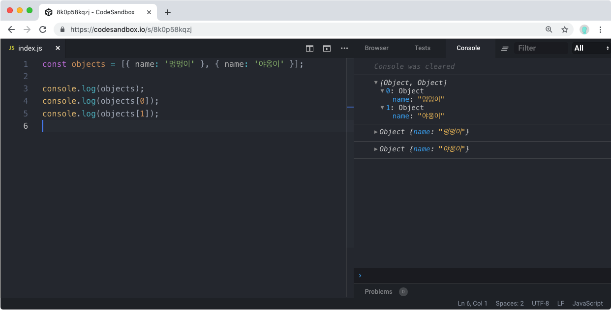

# JS배열

이번에는 배열을 배워봅시다. 이전에 배운 객체는 한 변수 혹은 상수에 여러가지 정보를 담기 위함이였다면, 배열은 여러개의 항목들이 들어있는 리스트와 같습니다.

예를 들어서 숫자 배열을 선언해봅시다.

```jsx
const array = [1, 2, 3, 4, 5];
```

배열을 선언 할 때에는 이렇게 `[ ]` 안에 감싸주시면 됩니다.

배열 안에는 어떤 값이던지 넣을 수 있습니다.

예를 들어서, 객체 배열을 만들어볼까요?

예를 들어서, 객체 배열을 만들어볼까요?

```jsx
const objects = [{ name: "멍멍이" }, { name: "야옹이" }];
```

배열을 선언하고 나서, n 번째 항목을 조회하고 싶을 땐 다음과 같이 할 수 있습니다.

```jsx
objects[n];
```

한번 다음 코드를 입력해보세요.

```jsx
const objects = [{ name: "멍멍이" }, { name: "야옹이" }];

console.log(objects);
console.log(objects[0]);
console.log(objects[1]);
```



여기서 주의하실 점은, 첫번째 항목이 `objects[1]` 이 아니라 `objects[0]` 이라는 것 입니다.
여기서 `objects[1]` 이 두번째 항목입니다.
